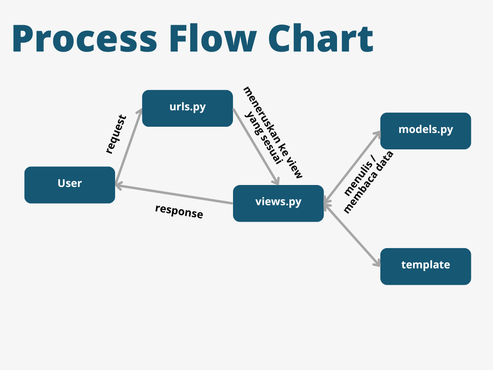

# Teleplay

Teleplay adalah sebuah <b>E-Commerce</b> yang memberikan layanan entertainment atau informasi berupa video untuk dinikmati khayalak umum. Proyek Teleplay ini ditujukan untuk Tugas Mata Kuliah Pemrograman Berbasis Platform oleh Fransisca Ellya Bunaren dengan NPM 2306152286. Proyek ini dibuat dengan sistem operasi microsoft. Tautan menuju aplikasi PWS yang sudah di-deploy : [http://fransisca-ellya-teleplay.pbp.cs.ui.ac.id/](http://fransisca-ellya-teleplay.pbp.cs.ui.ac.id/)

## Tugas 2
### 1.Proses Pembuatan Proyek Django
1. Membuat sebuah repository lokal bernama `teleplay` dan membuat sebuah repository github bernama 'teleplay'

2. Buat <i>branch</i> utama baru di terminal atau command prompt, jalankan 
```
git branch -M master
```

3. Hubungkan dengan repositori Github. <br>
Jalankan perintah dengan url yang didapatkan di github, 
```
git remote add origin <URL_REPO>
```

4. Di direktori lokal, buat virtual environment Python baru dengan command :
```
python -m venv env
```

5. Mengaktifkan <i>virtual environment</i> dengan perintah berikut.  
```
env\Scripts\activate
```


6. Di dalam direktori sama, buat berkas `requirements.txt`dan tambahkan beberapa dependencies. 
```
django
gunicorn
whitenoise
psycopg2-binary
requests
urllib3
```

7. Melakukan instalasi <i>depedencies</i> dengan perintah berikut.
```
pip install -r requirements.txt
```

8. Buat proyek Django bernama `teleplay` dengan cara
```
django-admin startproject teleplay .
```

9. Menambahkan kedua string pada `ALLOWED_HOST` di `settings.py` untuk keperluan deployment:
```
ALLOWED_HOSTS = ["localhost", "127.0.0.1"]
```

10. Untuk membuat aplikasi baru dengan nama <b>main</b> 
```
python manage.py startapp main
```

11. Tambahkan `'main'` ke dalam `INSTALLED_APPS` sebagai elemen terakhir yang terdapat di `settings.py` di dalam direktori proyek `teleplay`. 

```
INSTALLED_APPS = [
    ...,
    'main'
]
```

12. Buat berkas `models.py` pada direktori aplikasi `main`. Isi berkas `models.py` adalah sebagai berikut. 
```
from django.db import models

class Video(models.Model):
    name = models.CharField(max_length=255)
    price = models.IntegerField()
    description = models.TextField()
    release_date = models.DateField(auto_now_add=True)
    duration = models.DurationField()
    rating = models.DecimalField(max_digits=2, decimal_places=1)

    @property
    def is_movie_good(self):
        return self.rating > 7
```

13. Melakukan migrasi model. Jalankan perintah berikut untuk membuat migrasi model.
```
python manage.py makemigrations
```

14. Menjalankan perintah berikut untuk menerapkan migrasi ke dalam basis data lokal.
```
python manage.py migrate
```

14. Membuat direktori baru bernama `templates` di dalam direktori aplikasi `main`. Di dalam direktori tersebut, buat berkas bernama `main.html`. Berkas tersebut berisi nama E-Commerce, nama, dan kelas. 

```
<h1>{{ app_name }}</h1>
<p>Sebuah <b>E-Commerce</b> yang memberikan layanan entertainment atau informasi berupa video untuk dinikmati khayalak umum</p>

<h5>Name: </h5>
<p>{{ name }}</p>
<h5>Class: </h5>
<p>{{ class }}</p>
```
15. Untuk mengintegrasikan komponen MVT, buka berkas `views.py` yang terletak di dalam berkas aplikasi `main`. Tambahkan fungsi `show_main` yang akan mereturn fungsi render beserta argumennya. Fungsi ini untuk render tampilan HTML dengan menggunakan data yang diberikan. Berkas `views.py` akan berisi sebagai berikut.

```
from django.shortcuts import render

def show_main(request):
    context = {
        'app_name' : 'Teleplay',
        'name' : 'Fransisca Ellya Bunaren',
        'class' : 'PBP F'
    }

    return render(request, "main.html", context)
```

16. Mengonfigurasi <i>Routing</i> pada aplikasi `main` pada file `urls.py` di direktori `main`. 
```
from django.urls import path
from main.views import show_main

app_name = 'main'

urlpatterns = [
    path('', show_main, name='show_main'),
]
``` 

17. Mengonfigurasi <i>Routing</i> pada aplikasi `main` pada file `urls.py` di subdirektori `teleplay`.
```
from django.contrib import admin
from django.urls import path, include

urlpatterns = [
    path("admin/", admin.site.urls),
    path('', include('main.urls'))
]
```

18. Menguji aplikasi pada localhost dengan perintah. Kemudian,  membuka di `http://localhost:8000/` di peramban web. 
```
python manage.py runserver
```


19. Melakukan deployment ke PWS terhadap aplikasi dengan cara. Pertama, tekan `Create New Project`, isi `Project Name` dengan `teleplay`, dan tekan `Create New Project`. Akan muncul, <i>Project Credentials</i> dan <i>Project Commands</i> simpan kedua hal tersebut. Pada `settings.py` di subdirektori `teleplay`, tambahkan URL deployment PWS pada ALLOWED_HOSTS. 
```
...
ALLOWED_HOSTS = ["localhost", "127.0.0.1", "fransisca-ellya-teleplay.pbp.cs.ui.ac.id"]
...
```
Melakukan `git add`, `commit`, dan `push` di github.

Tautan menuju aplikasi PWS yang sudah di-deploy : [http://fransisca-ellya-teleplay.pbp.cs.ui.ac.id/](http://fransisca-ellya-teleplay.pbp.cs.ui.ac.id/)

20. Jalankan perintah yang terdapat pada PWS. Ketika melakukan pws, masukkan credential yang diterima. Lalu, jalankan perintah ini untuk kembali mengubah nama branch utama kamu menjadi master.
`git branch -M master`

21. Pada side bar situs PWS, klik proyek untuk melihat status deployemnt. Apabila `Running`, dapat mengakses URL deployment dengan menekan `View Project`. Lakukan,
```
git push pws master: master
```

### 2. Bagan Request Client ke Web Aplikasi Berbasis Django Beserta Responnya

Seorang user melakukan request yang akan diproses terlebih dahulu melalui urls.py. Kemudian, urls.py meneruskan ke view yang sesuai di views.py. Lalu, view akan membaca/menulis data di model dan menggunakan template untuk menentukan tampilan antarmuka pengguna. Setelah itu, views.py akan mengembalikan response ke user. 

### 3. Fungsi `git` dalam Pengembangan Perangkat Lunak
Git adalah sistem kontrol versi yang memiliki tujuan untuk melacak perubahan pada kode sumber proyek sehingga dapat memantau semua revisi yang telah dilakukan pada proyek seiring waktu. Git memainkan peran penting dalam pengembangan perangkat lunak modern dan kolaborasi tim dengan melacak perubahan kode, menyimpan versi, dan bekerja bersama dlam proyek secara efisien. 

### 4. Alasan Framework Django Dijadikan Permulaan Pembelajaran Pengembangan Perangkat Lunak
Django adalah kerangka (framework) yang populer untuk pengrmbangan aplikasi web dengan bahasa pemrograman Python. Django sering dijadikan permulaan dalam pembelajaran pengembangan perangkat lunak dengan alasan sebagai berikut.
* <b>Struktur yang terorganisir dan mudah dipahami</b> <br>
Django memiliki arsitektur MVT (Model-View-Template) yang memisahkan logika aplikasi, interaksi database, dan antarmuka pengguna.
* <b>Fitur lengkap</b> <br>
Django memiliki banyak fitur bawaan, seperti ORM(Object-Relational Mapping) dan masih banyak lagi. 
* <b>Pendekatan yang Berfokus pada Keamanan</b> <br>
Django memiliki berbagai fitur keamanan bawaan sehingga ini mengajarkan untuk membangun aplikasi yang aman sejak awal.
* <b>Dokumentasi Detail dan Komunitas yang Besar</b> <br>
Django memiliki dokumentasi yang sangat baik dan banyak tutorial.
* <b>Mendorong Praktik Pengembangan yang Baik</b> <br>
Django mengajarkan untuk melakukan praktik DRY (Don't Repeat Yourself), penggunaan pola desain, dan struktur proyek yang modular.
* <b>Scability dan Real-World Use</b> <br>
Django juga digunakan oleh perusahaan besar sehingga ini membuktikan bahwa keterampilan yang dipelajari relevan juga untuk dunia nyata.
* <b>Mudah dipelajari untuk Latar Belakang yang Ragam</b> <br>
Django menggunakan python yang mudah dipelajari. Ini membuat Django lebih mudah diakses oleh orang dari berbagai macam latar. 

### 5. Alasan Model Django Disebut Sebagai ORM
Model Django disebut sebagai ORM (Object-Relational Mapping) karena berfungsi sebagai penghubung antara kode Python dan dtabase relasional. Berikut adalah alasan mengapa Model Django dianggap sebagai ORM.
* <b>Menghubungkan Objek Python dengan Tabel Database</b> <br>
Dengan ORM, bisa memungkinkan untuk bekerja dengan database menggunakan objek Python. 
* <b>Abstaraksi Database</b> <br>
Django menyembunyikan kompleksitas SQL dari pengembang sehingga memungkinkan mereka untuk fokus pada logika aplikasi
* <b>Mapping Otomastis antara Kode dan Database</b> <br>
Django secara otomatis memetakan atribut kelas model ke kolom database dan instance model ke baris dengan tabel. 
* <b>Dukungan untuk Berbagai Jenis Database</b> <br>
Django ORM mendukung berbagai database, seperti Oracle.
* <b>Otomatisasi Query SQL dari Kode Python</b> <br>
ORM memungkinkan untuk menulis query kompleks menggunakan metode chaining yang mudah dibaca, seperti .filter()
* <b>Validasi Data dan Manajemen Skema yang Mudah</b> <br>
Django memungkinkan pengembang mengelola versi skema database dengan menyediakan migrasi otomatis dan mempervarui aplikasi secara aman. 
* <b>Keamanan</b> <br>
Django ORM menyediakan lapisan keamanan yang mencegah serangan SQL injection dengan otomatis.
* <b>Pengembangan yang Lebih Cepat</b> <br>
Menggunakan ORM dapat mempercepat proses pengembangan karena pengambang tidak perlu menuliskan kode SQL secara eksplisit. Selain itu, ORM memudahkan proses debugging dan perubahan skema.

Dengan alasan-alasan tersebut, model Django disebut sebagai ORM karena menyediakan cara yang lebih mudah, aman, dan efisien untuk berinteraksi dengan database relasional menggunakan kode Python. 